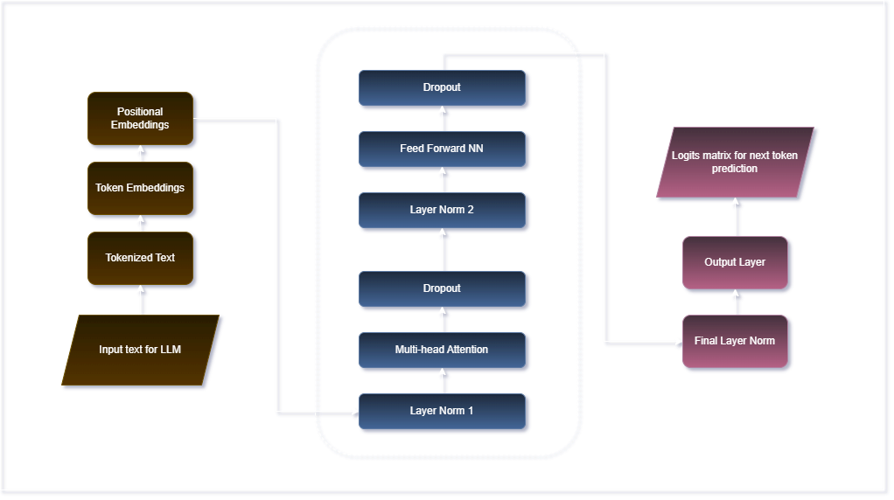
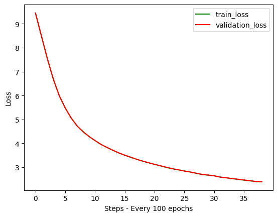

# Small Language Model (SLM) from Scratch

This repository contains an implementation of a **Small Language Model (SLM)** built completely from scratch, inspired by the original Transformer architecture (GPT-like).  
The model is trained on the **TinyStories dataset**, a synthetic dataset of short stories generated by GPT-3.5/4, designed to be understandable by 3-4 year olds.

---

## 🚀 Project Structure

```
.
├── outputs/            # Training outputs (loss curves, checkpoints, logs)
├── Architecture.png    # Architecture diagram of the SLM
├── inference.py        # Inference / text generation script
├── layers.py           # Implementation of Transformer layers (Attention, MLP, etc.)
├── main.py             # Training loop and entry point
├── model.py            # GPT model architecture
├── tokenizer.py        # Tokenizer using GPT-2 encoding (tiktoken)
├── utils.py            # Utility functions (batching, loss estimation, etc.)
└── README.md           # Project documentation
```

---

## ⚡ Features

- Custom-built **Transformer-based architecture** (mini GPT-like).
- ~50M parameters (6 layers, 6 heads, 384 embedding size).
- Trained on **TinyStories dataset** from HuggingFace.
- Implements:
  - Word embeddings + positional embeddings
  - Multi-head causal self-attention
  - Layer normalization
  - Feedforward networks with GELU activation
  - Residual connections
  - Dropout regularization
- Training pipeline with:
  - AdamW optimizer
  - Linear warmup + cosine decay learning rate scheduler
  - Gradient accumulation
  - Mixed precision support (`float16` / `bfloat16`)
- Inference function for **autoregressive text generation**.

---

## 🧩 Architecture Overview

1. **Input Layer**
   - Token IDs → Word Embeddings (50257 x 384)
   - Positional Embeddings (128 x 384)
   - Sum of embeddings + Dropout

2. **Transformer Blocks (x6)**
   - LayerNorm → Multi-head causal attention → Dropout → Residual
   - LayerNorm → Feed Forward (Linear → GELU → Linear) → Dropout → Residual

3. **Output**
   - Final LayerNorm
   - Linear layer (tied with embeddings)
   - Logits matrix → Next-token prediction probabilities

Architecture diagram:  


---

## 📦 Installation

Clone this repository and install dependencies:

```bash
git clone https://github.com/USERNAME/small_lang_model.git
cd small_lang_model
pip install -r requirements.txt
```

---

## 📊 Training

Run the training loop:

```bash
python main.py
```

This will:
- Load and tokenize the TinyStories dataset.
- Train the SLM on batches from `train.bin` / `validation.bin`.
- Save the best model checkpoint as `best_model_params.pt`.

---

## 💡 Inference

Generate text with the trained model:

```bash
python inference.py --prompt "Once upon a time, there was a little dragon"
```

Example output:

```
Once upon a time, there was a little dragon. The dragon loved to play in the forest with his friends...
```

---

## 📈 Results

During training, losses are logged and plotted in `outputs/`.  
A sample loss curve is shown below (train vs validation):


---

## 🛠️ Requirements

- Python 3.8+
- PyTorch
- datasets
- tiktoken
- numpy
- matplotlib

Install them via:

```bash
pip install torch datasets tiktoken numpy matplotlib
```

---

## 📚 References

- [Attention Is All You Need (Vaswani et al., 2017)](https://arxiv.org/abs/1706.03762)
- [nanoGPT by Andrej Karpathy](https://github.com/karpathy/nanoGPT)
- TinyStories Dataset: [roneneldan/TinyStories](https://huggingface.co/datasets/roneneldan/TinyStories)

---

## ✨ Acknowledgements

This project was completed as part of learning how to **build a language model from scratch** and was inspired by tutorials and open-source projects from the deep learning community.
